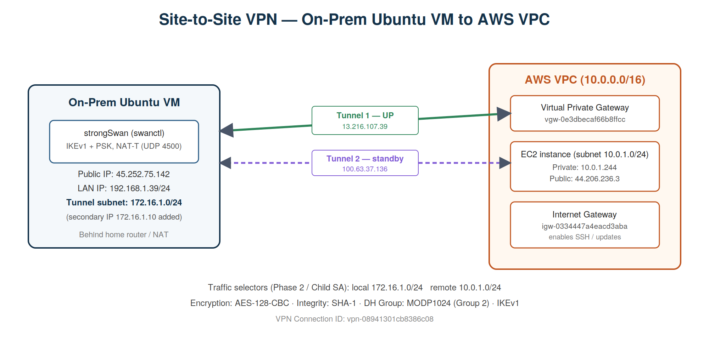
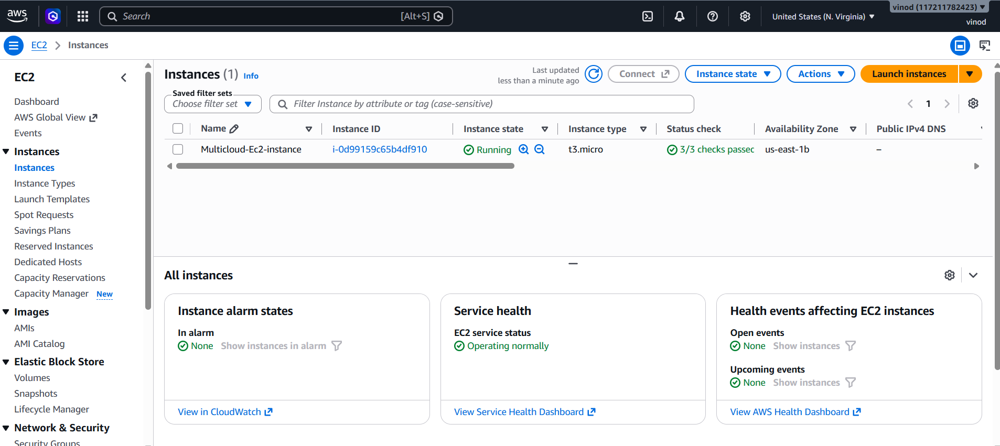
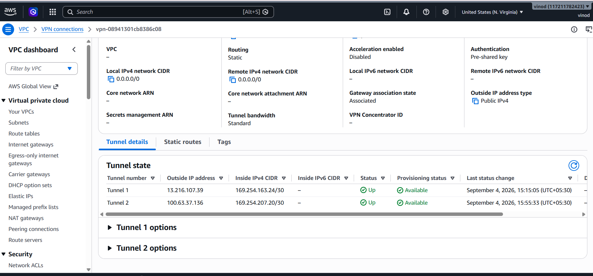
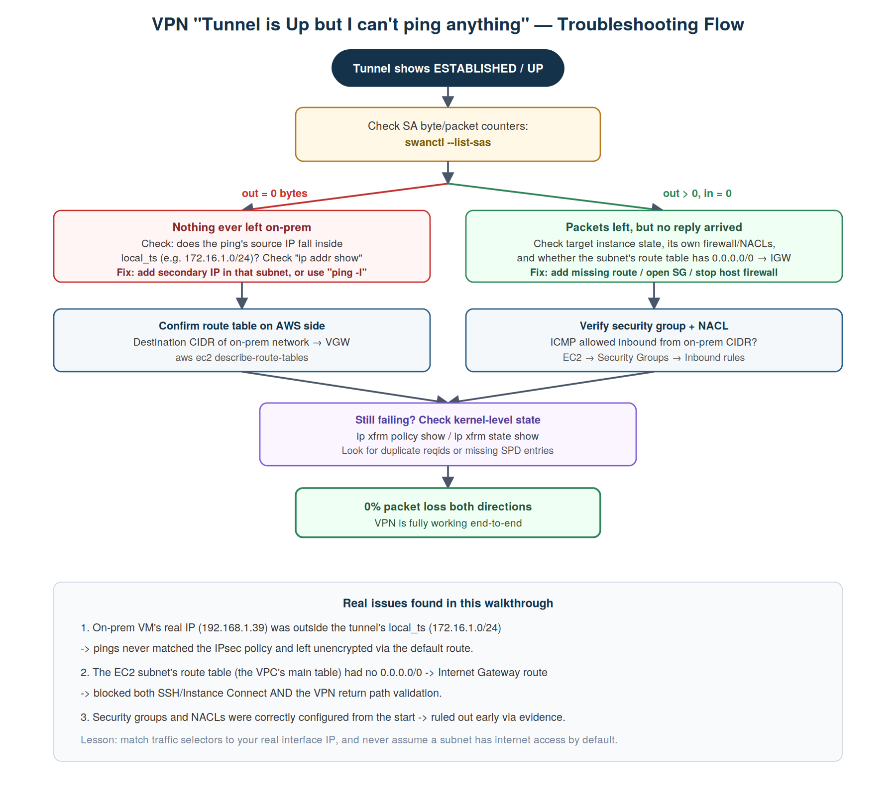
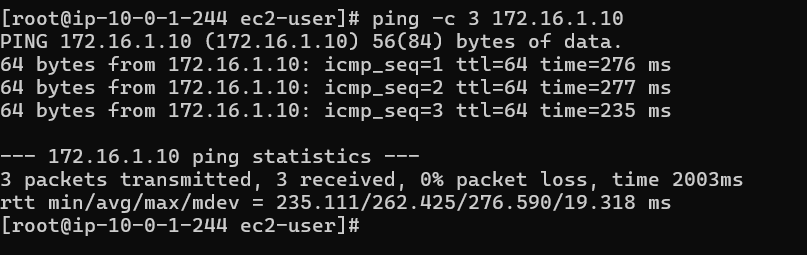
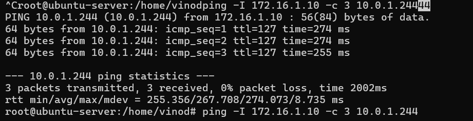

# Site-to-Site VPN: On-Prem Ubuntu ↔ AWS VPC

   

A real, command-by-command walkthrough for building an IPsec Site-to-Site VPN between a self-managed Ubuntu server and an AWS VPC using strongSwan (**swanctl**) — plus the two real bugs that broke connectivity after the tunnel showed `UP`, exactly how they were diagnosed, and how they were fixed.

> 📄 Full illustrated write-up: [`site-to-site-vpn-onprem-aws.md`](./site-to-site-vpn-onprem-aws.md) · [rendered HTML version](./site-to-site-vpn-onprem-aws.html)



## Table of Contents

- [Environment](#environment)
- [1. Prepare the on-prem VM](#1-prepare-the-on-prem-vm)
- [2. Build the AWS side](#2-build-the-aws-side)
- [3. Configure strongSwan (swanctl)](#3-configure-strongswan-swanctl)
- [4. The tunnel is up, but nothing pings — real debugging](#4-the-tunnel-is-up-but-nothing-pings)
- [5. Verification](#5-verification)
- [Troubleshooting cheat sheet](#troubleshooting-cheat-sheet)
- [Cleanup](#cleanup)

## Environment

| Component | Value |
|---|---|
| On-prem public IP | `45.252.75.142` |
| On-prem LAN IP (behind NAT) | `192.168.1.39/24` |
| On-prem tunnel subnet | `172.16.1.0/24` |
| AWS VPC CIDR | `10.0.0.0/16` |
| AWS EC2 subnet | `10.0.1.0/24` |
| EC2 private / public IP | `10.0.1.244` / `44.206.236.3` |
| VPC ID | `vpc-06cfe29168305f509` |
| VPN Connection ID | `vpn-08941301cb8386c08` |

strongSwan runs in **swanctl/vici mode** here, not the legacy `ipsec.conf` format most tutorials use — connection definitions live under `/etc/swanctl/conf.d/`.

## 1. Prepare the on-prem VM

```bash
sudo apt update && sudo apt install -y strongswan strongswan-pki libcharon-extra-plugins
sudo sysctl -w net.ipv4.ip_forward=1
echo "net.ipv4.ip_forward=1" | sudo tee -a /etc/sysctl.conf
curl ifconfig.me   # note your public IP for the Customer Gateway
```

## 2. Build the AWS side

```bash
# VPC + subnet + IGW
aws ec2 create-vpc --cidr-block 10.0.0.0/16
aws ec2 create-subnet --vpc-id <vpc-id> --cidr-block 10.0.1.0/24
aws ec2 create-internet-gateway
aws ec2 attach-internet-gateway --vpc-id <vpc-id> --internet-gateway-id <igw-id>

# Customer Gateway (represents your on-prem public IP)
aws ec2 create-customer-gateway --type ipsec.1 --public-ip <your-public-ip> --bgp-asn 65000

# Virtual Private Gateway
aws ec2 create-vpn-gateway --type ipsec.1 --amazon-side-asn 64512
aws ec2 attach-vpn-gateway --vpc-id <vpc-id> --vpn-gateway-id <vgw-id>

# VPN connection + static route + config download
aws ec2 create-vpn-connection --type ipsec.1 --customer-gateway-id <cgw-id> --vpn-gateway-id <vgw-id> --options StaticRoutesOnly=true
aws ec2 create-vpn-connection-route --vpn-connection-id <vpn-id> --destination-cidr-block 172.16.1.0/24
aws ec2 describe-vpn-connections --vpn-connection-id <vpn-id> --query "VpnConnections[0].CustomerGatewayConfiguration" --output text > vpn-config.xml

# Route table — the step most people forget
aws ec2 create-route --route-table-id <rtb-id> --destination-cidr-block 172.16.1.0/24 --gateway-id <vgw-id>
aws ec2 enable-vgw-route-propagation --route-table-id <rtb-id> --gateway-id <vgw-id>
```

⚠️ `vpn-config.xml` contains your real pre-shared keys in plaintext — `chmod 600` it, never commit it.



## 3. Configure strongSwan (swanctl)

`/etc/swanctl/conf.d/aws-tunnel1.conf`:
```
connections {
    aws-tunnel1 {
        version = 1
        remote_addrs = <aws-tunnel1-outside-ip>
        proposals = aes128-sha1-modp1024
        local  { auth = psk; id = <your-public-ip> }
        remote { auth = psk; id = <aws-tunnel1-outside-ip> }
        children {
            aws-tunnel1 {
                local_ts = 172.16.1.0/24
                remote_ts = 10.0.1.0/24
                esp_proposals = aes128-sha1-modp1024
                start_action = trap
                dpd_action = restart
                life_time = 1h
                rekey_time = 55m
            }
        }
    }
}
```

`/etc/swanctl/conf.d/aws-tunnel1-secrets.conf`:
```
secrets {
    ike-aws-tunnel1 {
        id-1 = <your-public-ip>
        id-2 = <aws-tunnel1-outside-ip>
        secret = "<psk-from-vpn-config.xml>"
    }
}
```

```bash
sudo chmod 600 /etc/swanctl/conf.d/*.conf
sudo swanctl --load-all
sudo swanctl --initiate --child aws-tunnel1
sudo swanctl --list-sas
```

Repeat with a second file (`aws-tunnel2.conf`) pointed at AWS's second outside IP for redundancy — matching config, different `remote_addrs`/`id`.



## 4. The tunnel is up, but nothing pings

Both tunnels showed `UP`. Pings still failed 100%. Here's the real diagnosis, in order:

```bash
sudo swanctl --list-sas
#   in  c985c83f,      0 bytes,     0 packets
#   out c43b0083,      0 bytes,     0 packets   <- tunnel healthy, but ZERO traffic ever used it
```

```bash
ip addr show
#   inet 192.168.1.39/24 ...   <- real IP is OUTSIDE local_ts (172.16.1.0/24)!
```

**Bug #1:** IPsec matches traffic against `local_ts`/`remote_ts` (the Security Policy Database), not the kernel routing table. Since the VM's real IP wasn't inside `172.16.1.0/24`, every ping silently left over the normal default route instead of entering the tunnel.

**Fix:**
```bash
sudo ip addr add 172.16.1.10/24 dev enp0s3
ping -I 172.16.1.10 10.0.1.244
```

That got packets *out*, confirmed via:
```bash
sudo ip xfrm state show
# dir out: lastused set, oseq incrementing   -> left on-prem correctly, encrypted
# dir in:  oseq 0x0, no lastused              -> AWS never sent anything back
```

**Bug #2:** the EC2 subnet had no explicit route table association, so it fell back to the VPC's main route table — which had a route back to on-prem, but **no `0.0.0.0/0 → Internet Gateway` route at all**. This blocked SSH, EC2 Instance Connect, and the final leg of return VPN traffic simultaneously (a good reminder: unrelated-looking symptoms that appear together often share one root cause).

**Fix:**
```bash
aws ec2 describe-internet-gateways --filters "Name=attachment.vpc-id,Values=<vpc-id>" \
  --query "InternetGateways[].InternetGatewayId" --output text

aws ec2 create-route --route-table-id <rtb-id> --destination-cidr-block 0.0.0.0/0 --gateway-id <igw-id>
```

Full diagnostic walkthrough with every command's actual output: see [the full article](./site-to-site-vpn-onprem-aws.md#part-4--the-tunnel-is-up-but-i-cant-ping-anything).



## 5. Verification

AWS → on-prem:


On-prem → AWS:


0% packet loss, both directions. ✅

## Troubleshooting cheat sheet

| Question | Command |
|---|---|
| Is the IKE/ESP session up? | `sudo swanctl --list-sas` |
| Is traffic actually flowing? | check `in`/`out` byte counters in the same command |
| What's my real interface IP? | `ip addr show` |
| Will this packet use the tunnel? | `ip route get <dest-ip>` |
| Kernel IPsec policy table | `sudo ip xfrm policy show` |
| Kernel active SA state | `sudo ip xfrm state show` |
| Is NAT-T traffic leaving the NIC? | `sudo tcpdump -i <iface> udp port 4500 -n` |
| Does the subnet route to the VGW? | `aws ec2 describe-route-tables --filters "Name=vpc-id,Values=<vpc-id>"` |
| Does *this subnet* use that table? | `aws ec2 describe-route-tables --filters "Name=association.subnet-id,Values=<subnet-id>"` |
| Does the subnet reach the internet? | look for `0.0.0.0/0 → igw-...` above |

## Cleanup

```bash
aws ec2 delete-vpn-connection --vpn-connection-id <vpn-id>
aws ec2 detach-vpn-gateway --vpn-gateway-id <vgw-id> --vpc-id <vpc-id>
aws ec2 delete-vpn-gateway --vpn-gateway-id <vgw-id>
aws ec2 delete-customer-gateway --customer-gateway-id <cgw-id>
aws ec2 terminate-instances --instance-ids <instance-id>
aws ec2 delete-vpc --vpc-id <vpc-id>
```

---

### Repo structure
```
.
├── README.md                          # this file
├── site-to-site-vpn-onprem-aws.md     # full illustrated walkthrough (source)
├── site-to-site-vpn-onprem-aws.html   # rendered, publish-ready HTML version
└── assets/
    ├── topology.png                   # architecture diagram
    ├── troubleshooting-flow.png       # debugging decision flow
    ├── ec2-instance-created.png
    ├── vpn-tunnels-up.png
    ├── ping-aws-to-onprem.png
    └── ping-onprem-to-aws.png
```

### License
Feel free to reuse this walkthrough for learning, internal documentation, or your own blog — attribution appreciated but not required.
